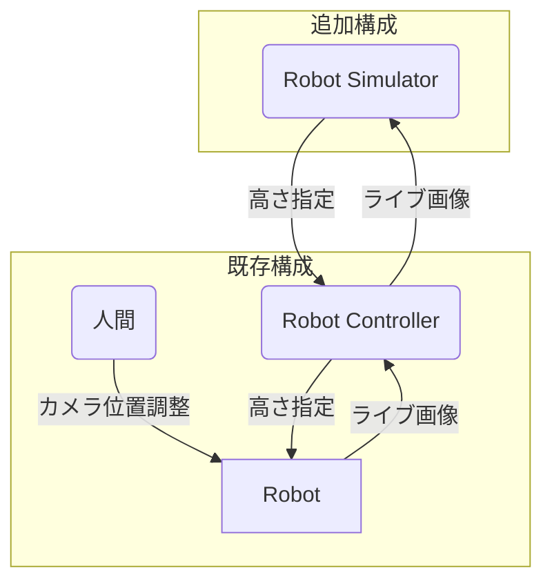
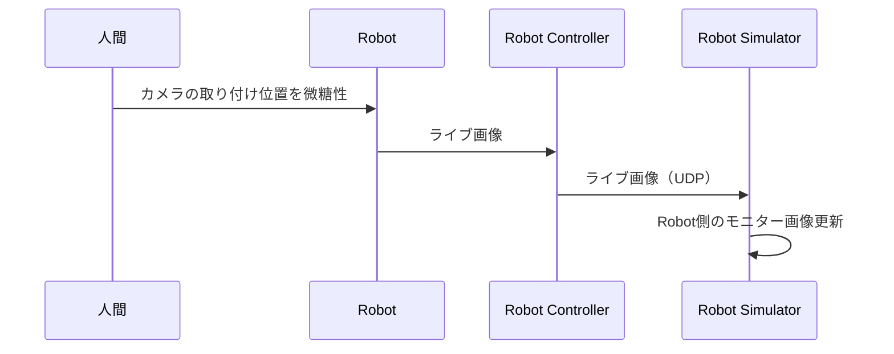

# UML-tips
UMLについて

plantumlという、テキストから図を起こすツールがあり、そこにUMLについての説明もある。

* [plantuml](https://plantuml.com/ja/)

mermaidはGithubでそのまま表示可能

* [mermaid](https://mermaid-js.github.io)

## 分析
* ユースケース図

### ユースケース図

誰が、何をなんの目的で、どのように行うか

## 設計
* 配置図
* シーケンス図

### 配置図
配置(deployment)が、ハード、ソフトの具体的な配置を説明し、システムが何に依存するかはっきりさせる

ソフト部を抜き出しより抽象化しているコンポーネント図は、配置図の中でも書くので、最初は配置図からやるといい

### シーケンス図
どのように連携するか
